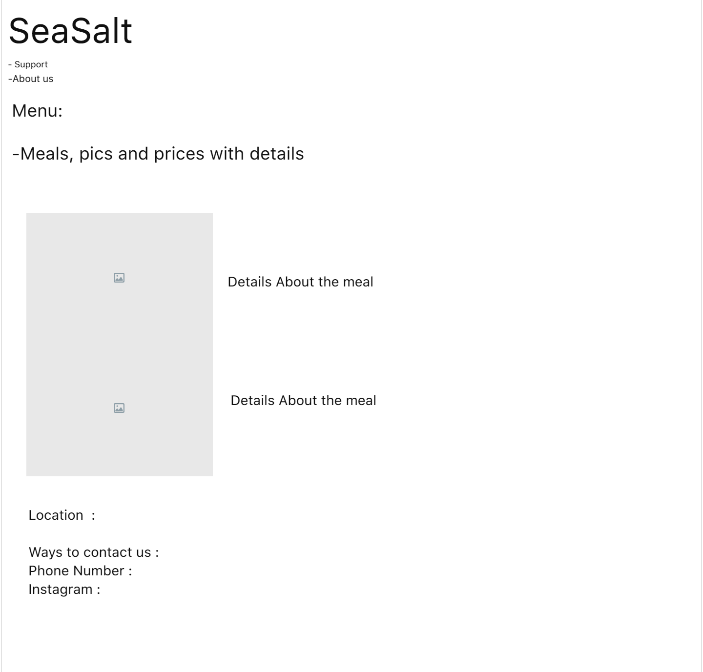
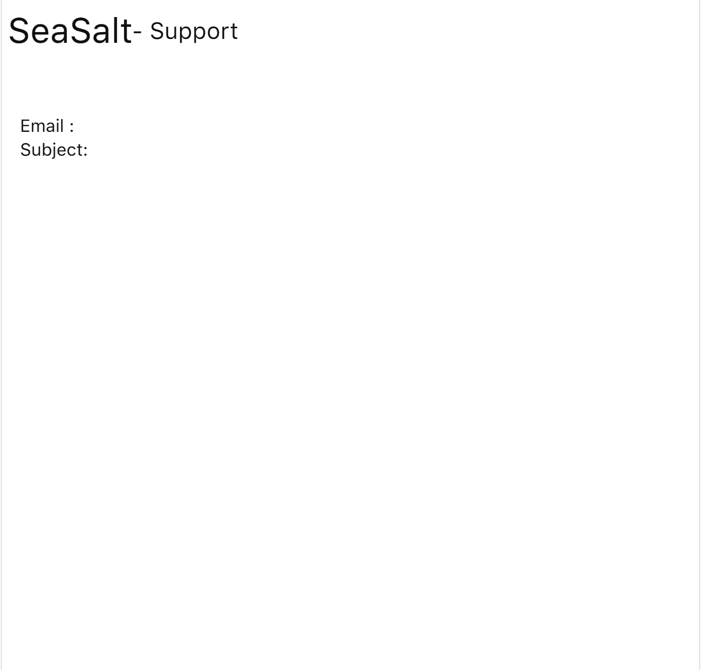
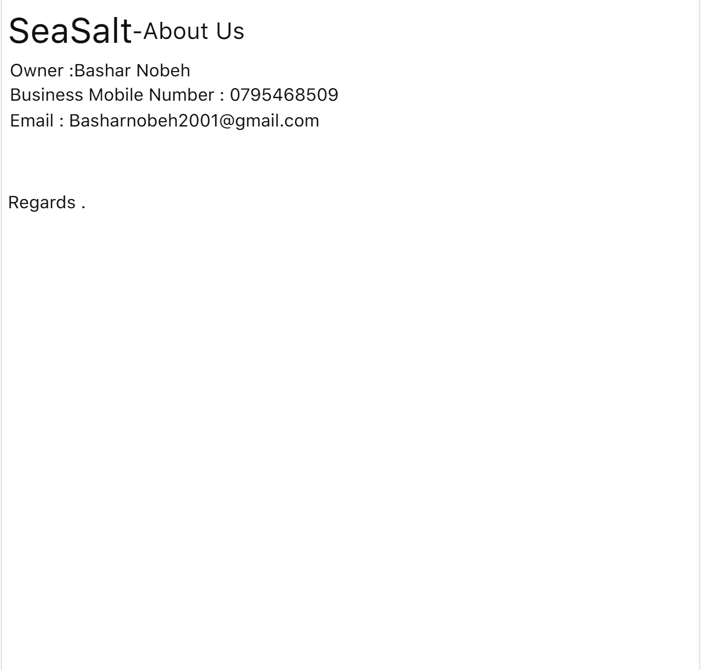

# **SeaSalt**
# _Served Fresh and Tasty_

 

# Our delicious Menu : 
 

># Blowfish (3 Pcs)  22$ 
 /cdn.vox-cdn.com/uploads/chorus_asset/file/16177665/Fish_sticks_horizontal.jpg)

> # Hake (2 Pcs)  28$ 

> # Crap   30$ 

>#  Brill 14.99$ 

> # Pomfret (One piece) 25$ 

>#  Pompano 17.99$ 

 

# Thank you for visiting us and Hope to "sea" You again 

 
